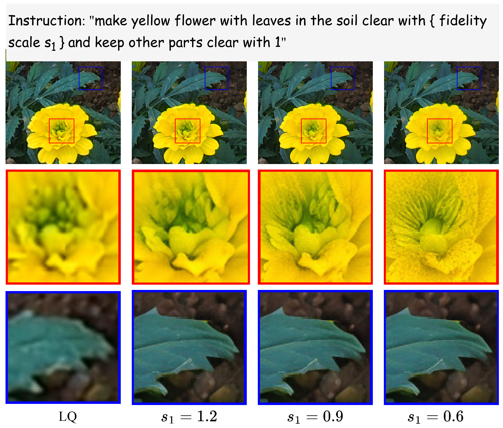
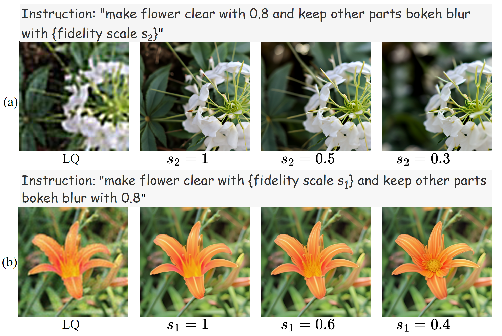
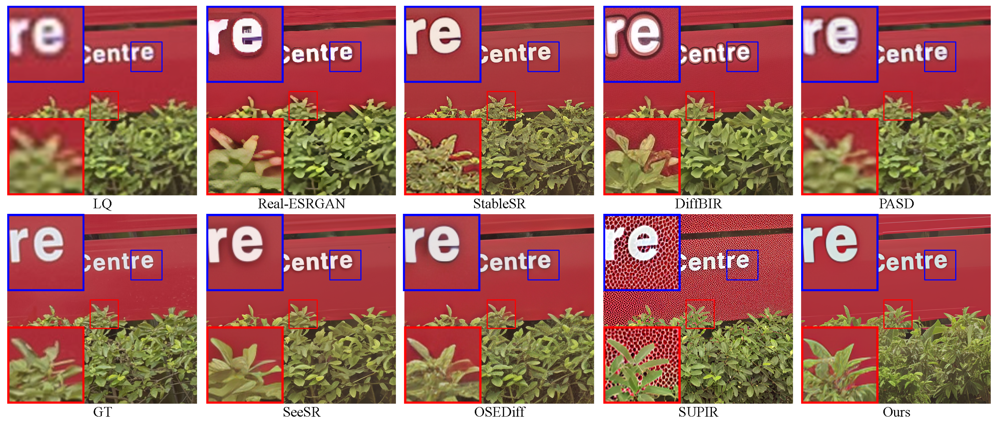
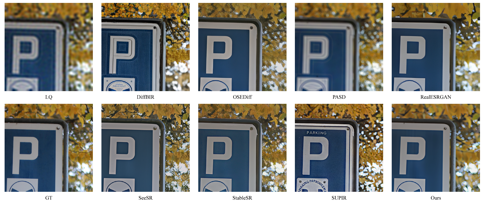
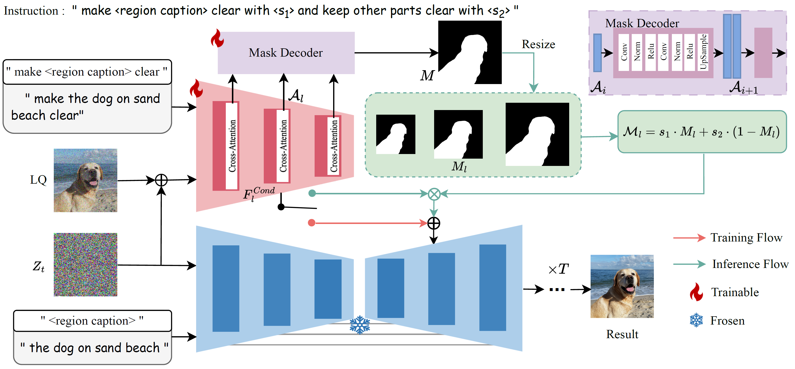
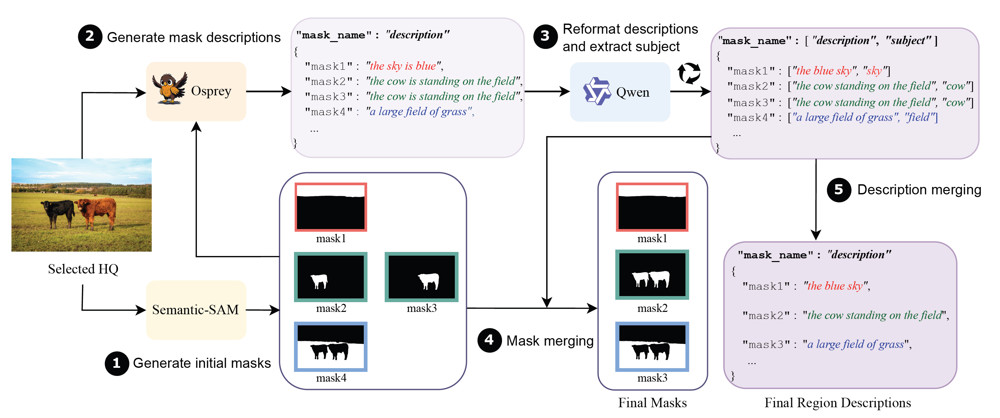

<h2>InstructRestore: Region-Customized Image Restoration with Human Instructions</h2>

Shuaizheng Liu1,2
| Jianqi Ma1 | 
Lingchen Sun1,2 | 
Xiangtao Kong1,2 | 
Lei Zhang1,2

1The Hong Kong Polytechnic University, 2OPPO Research Institute

##  💡  Overview

Our proposed **InstructionRestore** framework enables region-customized restoration following human instruction. 

(a) current methods tend to incorrectly restore the bokeh blur, while our method allows for adjustable control over the degree of blur based on user instructions. 

(b) existing methods fail to achieve region-specific enhancement intensities, while our approach can simultaneously suppress the over-enhancement in areas of building and improve the visual quality in areas of leaves.

##  🎨 Application
### Demo on Real-world Localized Enhancement

By following the instruction, the details in flowers are enhanced gradually while the other regions keeping almost unchanged.
### Demo on Controllable Bokeh Effects 

By following the instruction, 

(a) Restoration with controlled bokeh effect while restoring foreground. 

(b) Restoration with varying foreground enhancement levels while preserving background bokeh.

### Comparisons with Other DM-Based global restoration Methods
(a) For the localized enhancement

(b) For the preservation of bokeh effects

##  🍭 Achitecture

## 🌱  Dataset Construction Pipeline

